## Meta Learning
From [Machine Learning course](http://speech.ee.ntu.edu.tw/~tlkagk/courses_ML20.html) by [Prof Hung-yi Lee](http://speech.ee.ntu.edu.tw/~tlkagk/index.html)
## Table of Content
* Introduction to Meta Learning
* Model Agnostic Meta Learning (MAML) and Reptile
* Gradient Descent as LSTM
* Metric-based Meta Learning  

## Introduction to Meta Learning

* Meta learning is about *learning to learn*
* Let's say there are many learning tasks such as digit classification, face detection and regression
* Each of the learning task can be solved by learning a model 
* Meta Learning model **learns** how each of these tasks **learn** 
* Given a new unseen task, the meta learning model increases speed and efficiency of learning of the new task 

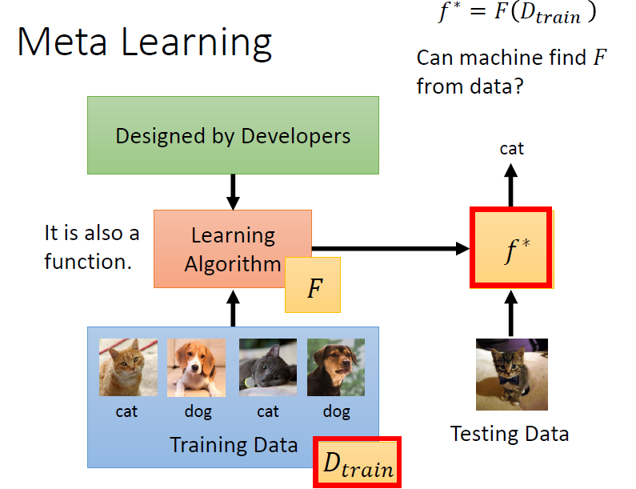

* Meta learning learns a function *F*
    * Input : Training data
    * Output : a model *f** which can classify given test data
* Function *F* can be seen as a learning algorithm
* Machine learning: Learn a function *f* based on training examples
* Meta learning: Learn a function *F* which learn a function *f** to solve machine learning tasks

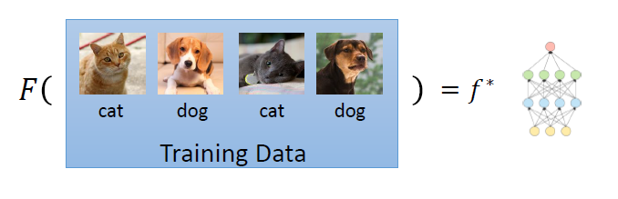

* The learned function *f** is used in inference (predict / classifies) given testing data

Steps of Meta Learning :
1. Define a set of function F
2. Define the goodness of function F
3. Pick the best function F

### Define a set of learning algorithm

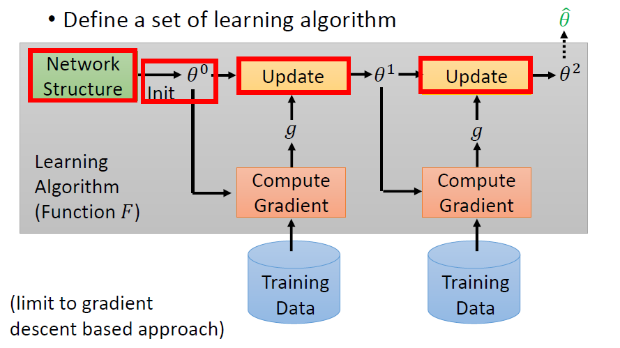

**Figure 1: Illustration of meta learning algorithm F**

* First, decide on a network structure *f* for the training tasks
* For image classification, the choice is CNN
* Initialize the neural network's parameters θ
* Sample training data 
* At each step, the learning algorithm F takes in training data and compute gradient
* Update the parameters θ with the computed gradient
* Repeat this processs to obtain <code>θ^</code>
* Different decisions in the **red** boxes lead to different algorithms
* For example, different initializations result in different <code>θ^</code>

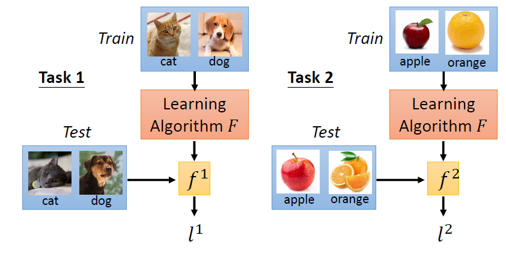

**Figure 2A: Training and test data for meta learning**

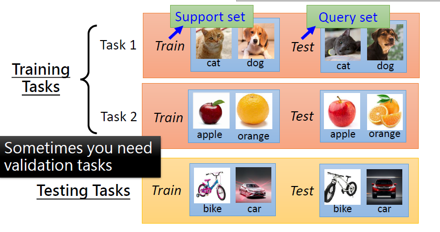

**Figure 2B: Training and test data for meta learning**

* The training set for meta learning is a set of datasets
* Each dataset is for a certain Machine Learning task such as:
    * Dog vs. cat classification
    * Apple vs. orange classification
* In other words, each training example for meta learning is a *task* 
* The tasks can be divided into :
    1. Training tasks: Tasks used to train meta learning model, F
    2. Testing tasks: Tasks used to evaluate performance of F
* The training tasks and testing tasks are **different**
* Each task consists of train and test data also. To avoid confusion with meta-train and meta-test dataset:
    * Train data of each task called support set
    * Testing data of each task called query set
* Learning algorithm F :
    * Input: Training tasks
    * Output: Parameters of task specific function *f* 
* F generates a task specific function *f* for each task
* In the figure, 
    * *f1* is the task specific function for Dog vs. Cat classification
    * *f2* is the task specific function for Apple vs. Orange classification
* The loss function formula :

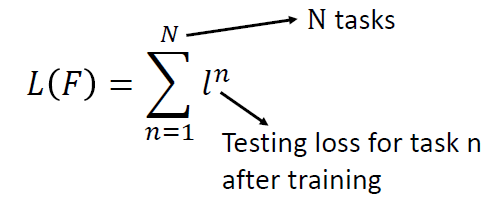

* The loss is computed on the testing tasks
* A sum of individual loss, *l* computed for each of the testing tasks

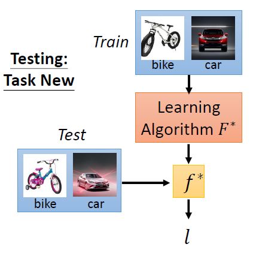

* For each testing task, *F* takes in the support set and outputs the task specific parameters or function *f* 
* Individual loss function differs by task, can be cross entropy or MSE
* Individual loss function measures performance of task specific function *f* for each testing task
* Individual loss *l* is computed using the function *f* and the query set of each task
* The training objective is to find the F such that it generates task specific parameters θ which minimize the loss on testing tasks

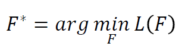

* Usually associated with **Few-shot learning** 
* Training on many training tasks making it very compute & memory intensive
* Therefore, training usually involves one or few gradient updates on each iteration with small dataset

### Dataset for meta-learning
**[Omniglot](https://github.com/brendenlake/omniglot)**

* 1623 characters

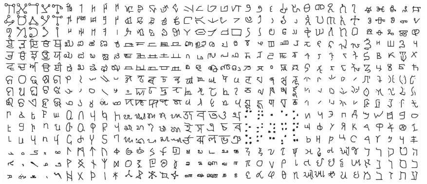 

* Each character has 20 examples

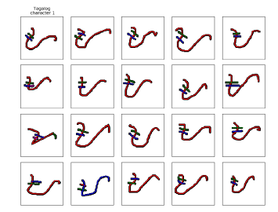

**Few-shot Classification**
* *N*-ways *K*-shot classification: In each training and test tasks, there are *N* classes
* Each class has *K* examples
* Split the characters into training and testing characters 
    * Sample *N* training characters, sample *K* examples from each sampled characters ⟶ one training task
    * Sample *N* testing characters, sample *K* examples from each sampled characters ⟶ one testing task

## Model-Agnostic Meta-Learning (MAML)

Paper :

[Chelsea Finn, Pieter Abbeel , and Sergey Levine, “Model
Agnostic Meta Learning for Fast Adaptation of Deep
Networks”, ICML, 2017](https://arxiv.org/abs/1703.03400)

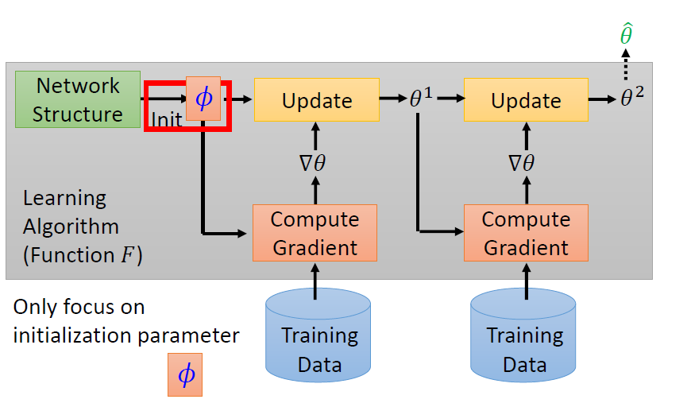

* In the past, parameters for a neural network is initialized according to some distribution
* MAML aims to learn the "best" parameters for initialization
* Input: Initiazed parameters of the neural network 𝜙
* Output: Model parameters learned from task *n* , <code>θ^_n</code>
* For a fixed F, different initialization ϕ results in different model parameters 
* Limitation of MAML is all tasks must use same model architecture
* The loss function for MAML :

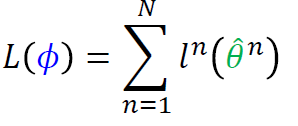

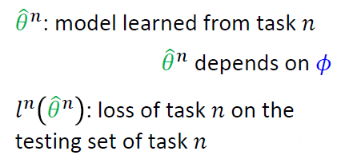

**General update rule for MAML :**

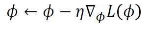

### Implementation of MAML

* Assuming one step gradient update 
* Update rule for one step gradient update:

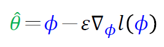

1. Initialize the model parameters, 𝜙
2. Sample one training task (or a batch)
3. Sample support set and query set for sampled training task
4. Obtain task specific parameter <code>θ^_n</code> by applying the update rule using the support set (Fine tune 𝜙 for training task)
5. Compute loss on query set using <code>θ^_n</code>
6. Update 𝜙 
7. Reiterate 2-7

Visualization of Training :

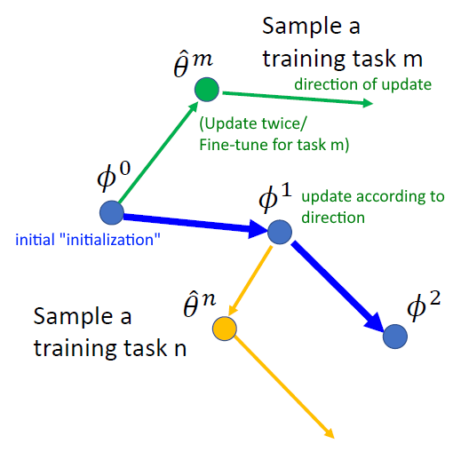

**Model Pre-training :**

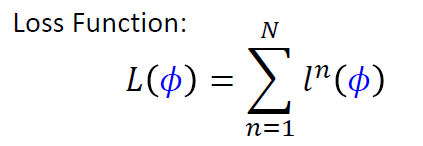

* Widely used in transfer learning
* In this case, 𝜙 is the parameters of the pre-trained model

**Comparison of MAML and Model Pre-training**

**MAML**

* Doesn't care about performance of ϕ (initialized parameters) on the training tasks
* Cares about performance of task specific parameters <code>θ^_n</code> that would be obtained after training by using ϕ as initialized parameters

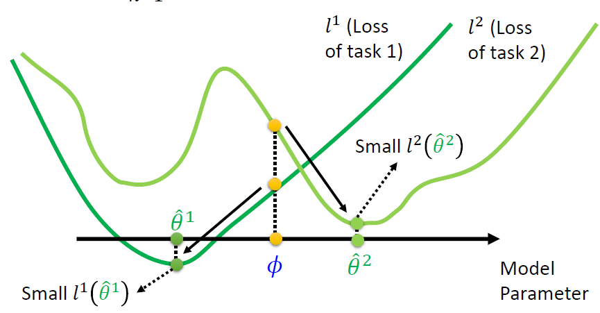

* Visualization of the loss curve for each task
* There are two tasks: task 1 and task 2
* The loss curve shows the loss for different choices of model parameters
* The yellow dot shows the loss for ϕ on each task, they are not at the local minima 
* Good ϕ can lead to the local minima easily 

Summary: Finds 𝜙 which achieves good performance after training (Focus on the potential of 𝜙)

**Model Pre-training**

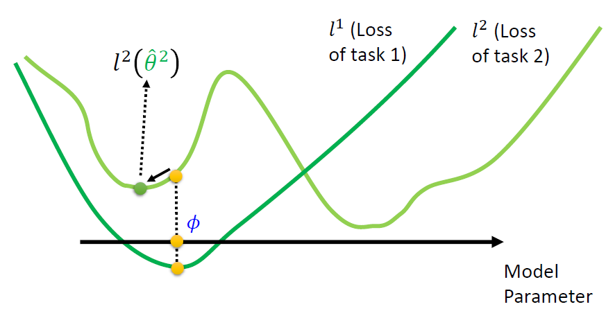

* Aims to find the "best" model parameters 𝜙 for every tasks
* Doesn't care so much about the result of using 𝜙 as initialization 
* Using  𝜙 as initialization may noy lead to good θ after training
* Using 𝜙 might get lower loss for each task when compared to MAML
* However, maybe stuck at the local minima, unable to improve over further training
Summary: Finds 𝜙 which achieves good performance (Focus on current performance of 𝜙)

### Reptile

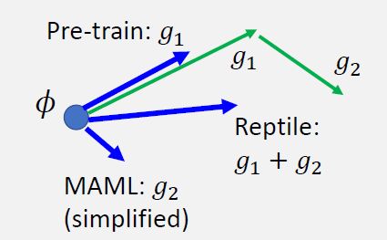

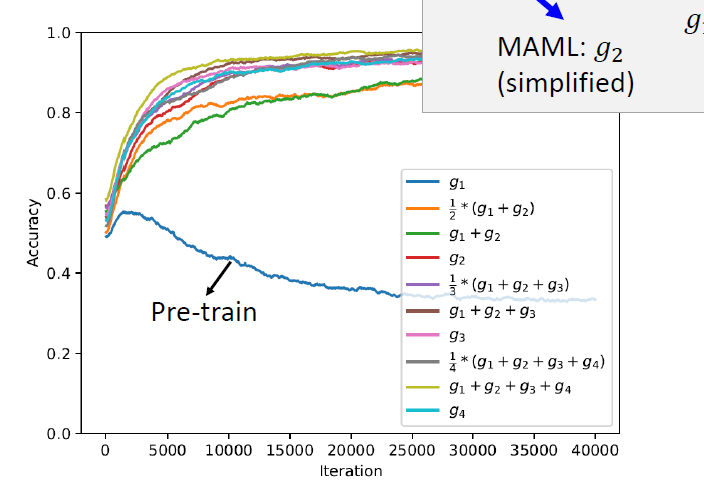

* Reptile performs much better when compared to model pre-training

### [Toy Example for MAML](https://towardsdatascience.com/paper-repro-deep-metalearning-using-maml-and-reptile-fd1df1cc81b0)

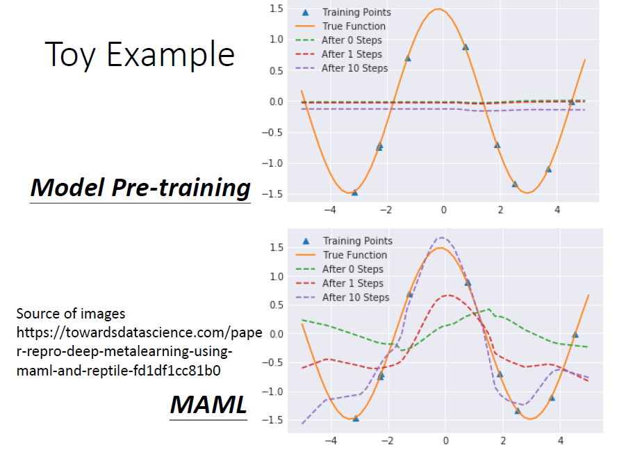

### Additional Information

Metric-based Meta Learning is also called Non-Parametric approach in Stanford University course [CS330](https://cs330.stanford.edu/)

* Video of [lectures](https://youtube.com/playlist?list=PLoROMvodv4rMC6zfYmnD7UG3LVvwaITY5) are avaialable at YouTube. 