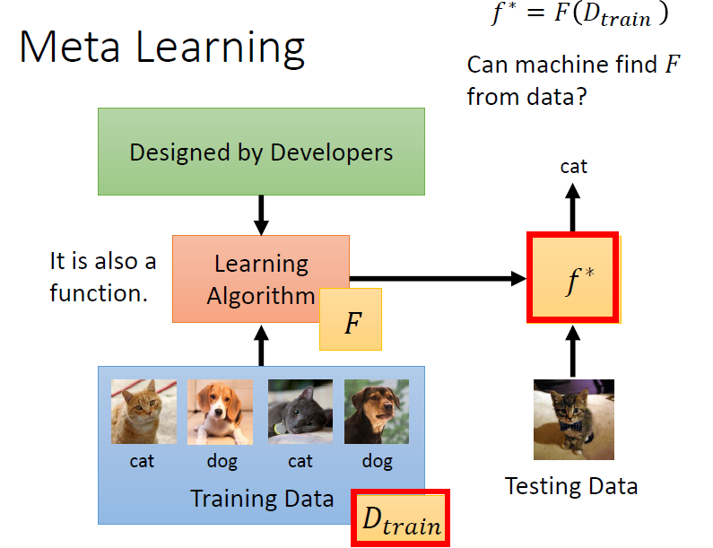
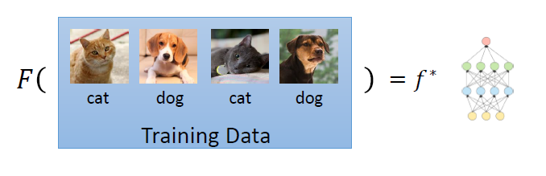
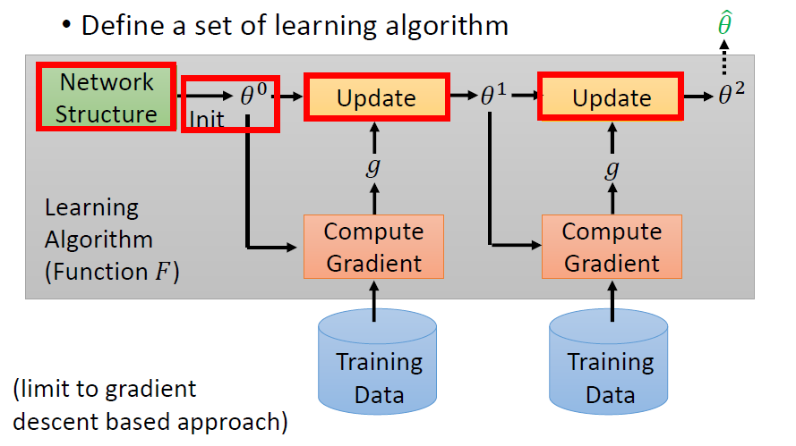
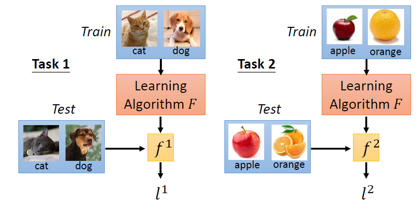
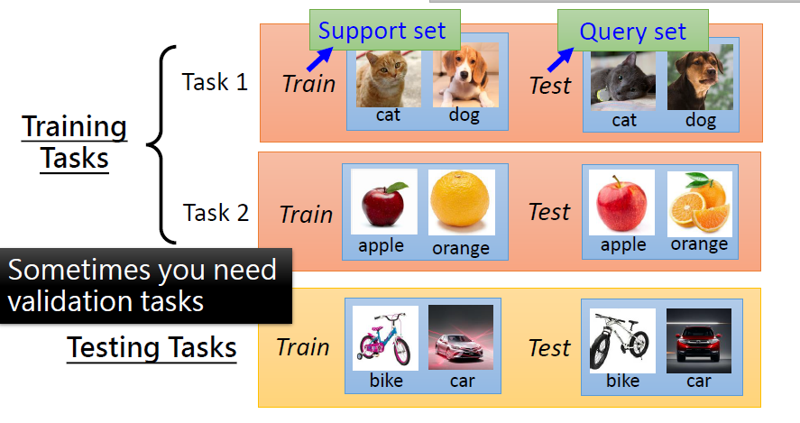
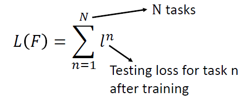
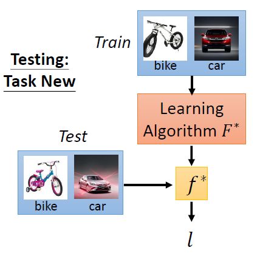
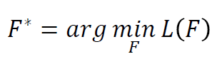
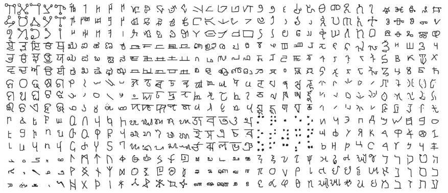
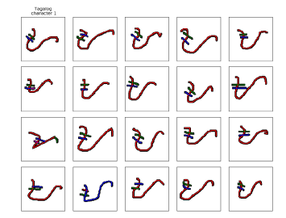

# Introduction to Meta Learning

# Table of Content
* Overview
* Steps of Meta Learning
    * Define a set of function
    * Define the goodness of function F
* Meta Learning and Few-shot Learning
* Dataset for meta-learning
## Overview

* Meta learning is about *learning to learn*
* Let's say there are many learning tasks such as digit classification, face detection and regression
* Each of the learning task can be solved by learning a model 
* Meta Learning model **learns** how each of these tasks **learn** 
* Given a new unseen task, the meta learning model increases speed and efficiency of learning of the new task 

* Meta learning learns a function *F*
    * Input : Training data
    * Output : a model *f** which can classify given test data
* Function *F* can be seen as a learning algorithm
* Machine learning: Learn a function *f* based on training examples
* Meta learning: Learn a function *F* which learn a function *f** to solve machine learning tasks

* The learned function *f** is used in inference (predict / classifies) given testing data

## Steps of Meta Learning 
1. Define a set of function F
2. Define the goodness of function F
3. Pick the best function F

### Define a set of function F

**Figure 1: Illustration of meta learning algorithm F**

* First, decide on a network structure *f* for the training tasks
* For image classification, the choice is CNN
* Initialize the neural network's parameters θ
* Sample training data 
* At each step, the learning algorithm F takes in training data and compute gradient
* Update the parameters θ with the computed gradient
* Repeat this processs to obtain <code>θ^</code>
* Different decisions in the **red** boxes lead to different algorithms
* For example, different initializations result in different <code>θ^</code>

**Figure 2A: Training and test data for meta learning**

**Figure 2B: Training and test data for meta learning**

* The training set for meta learning is a set of datasets
* Each dataset is for a certain Machine Learning task such as:
    * Dog vs. cat classification
    * Apple vs. orange classification
* In other words, each training example for meta learning is a *task* 
* The tasks can be divided into :
    1. Training tasks: Tasks used to train meta learning model, F
    2. Testing tasks: Tasks used to evaluate performance of F
* The training tasks and testing tasks are **different**
* Each task consists of train and test data also. To avoid confusion with meta-train and meta-test dataset:
    * Train data of each task called support set
    * Testing data of each task called query set
* Learning algorithm F :
    * Input: Training tasks
    * Output: Parameters of task specific function *f* 
* F generates a task specific function *f* for each task
* In the figure, 
    * *f1* is the task specific function for Dog vs. Cat classification
    * *f2* is the task specific function for Apple vs. Orange classification

### Define the goodness of function F

* The loss function formula :

* The loss is computed on the testing tasks
* A sum of individual loss, *l* computed for each of the testing tasks

* For each testing task, *F* takes in the support set and outputs the task specific parameters 
* There are *N* testing tasks, indexed using *n* = 1,2,3 ..., *N*
* Individual loss function differs by task, can be cross entropy or MSE
* Individual loss function measures performance of task specific function *f* for each testing task
* Individual loss *l* is computed using the function *f* and the query set of each task
* The training objective is to find the F such that it generates task specific parameters θ which minimize the loss on testing tasks

## Meta Learning and Few-shot Learning

* Meta learning is usually associated with **Few-shot learning** 
* Meta learning learns from how other ML models learn
* Training of each model can be very compute expensive
* Therefore, training a model for different training tasks can be compute and memory intensive
* Therefore, training usually involves one or few gradient updates on each iteration for a training task

## Dataset for meta-learning
**[Omniglot](https://github.com/brendenlake/omniglot)**

* 1623 characters

 

* Each character has 20 examples

**Few-shot Classification**
* *N*-ways *K*-shot classification: In each training and test tasks, there are *N* classes
* Each class has *K* examples
* Split the characters into training and testing characters 
    * Sample *N* training characters, sample *K* examples from each sampled characters ⟶ one training task
    * Sample *N* testing characters, sample *K* examples from each sampled characters ⟶ one testing task