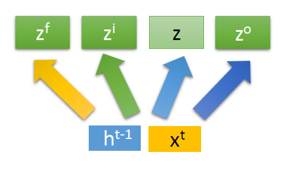
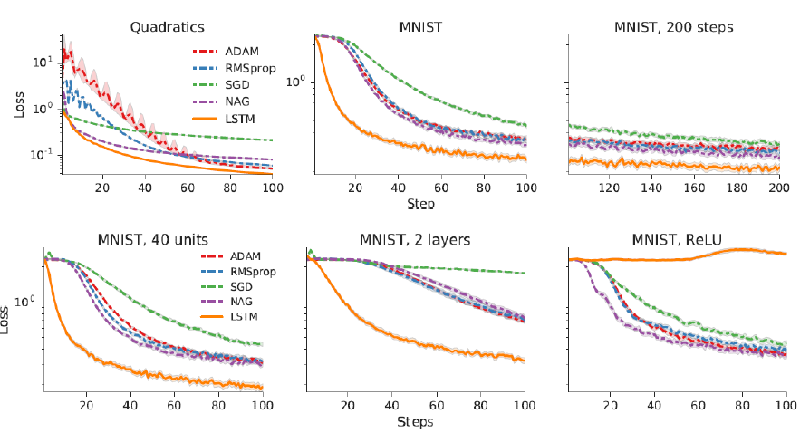

# Gradient Descent as LSTM

## Paper
[Learning to learn by gradient descent by gradient descent](https://arxiv.org/abs/1606.04474)
## Introduction

* Following figure visualizes the gradient descent algorithm

* The learning algorithm looks similar to a variant of neural network called Recurrent Neural Network (RNN)
* Treating gradient descent as LSTM, we can train a LSTM into something similar to a gradient descent algorithm
    * Note : LSTM is an advanced variant of RNN

## Recap of LSTM

* A naive RNN is a function <code> h',y = f(h,x) </code> where
    * x : input
    * h : memory value
    * y = output
* <code>h0</code> is the initialized memory value

* Unrolled view of RNN

* At each time step, RNN takes in a value of *x*
* The parameters are shared across time steps no matter how long input or output sequence is

* A LSTM 

* The memory cell is divided into *c* and *h*
    * *c* changes slowly 
    * *h* changes faster 
        

## LSTM for Gradient Descent

### Similarity to gradient descent based algorithm 

* Replacing <code>z^f</code> with a vector of ones
* Replacing <code>z^i</code> with a vector of η, learning rate
* Input is replaced with gradient 
* Memory cell *c* replaced with parameters θ
* Instead of using all "1" and all "η", can make <code>z^f</code> and <code>z^i</code> a learnable parameter
* In this case, <code>z^f</code> will become something like regularization and <code>z^i</code> becomes a dynamic learning rate

### Implementation

* The figure above shows a 3 training steps
* The parameters are learnable
    * Similar to MAML
* Takes a batch of train data
* Compute the gradient
* Generate the parameters using LSTM
* LSTM memory cell = parameters 
* But there could be million of parameters
* LSTM uses only one cell, shared across all parameters
* In typical gradient descent, all parameters use the same update rule
* Therefore, we can use LSTM memory cell to represent a small set of the complete parameters for meta learning
* Then, apply the same update rule on complete parameters
* Training and testing model architecture can be very different

### Difference with LSTM

* x and c,h are independent
* Parameters θ affects the gradient
* The dotted line in the figure : Actually can backpropagate through these paths
* The implementation in paper avoid them to reduce difference to LSTM

### Improvement

* Some optimization algorithm updates parameter depends not only on current gradients but also past gradients
* For example, RMSProp and Momentum
* Can have more than 1 layer of LSTM

* The second layer LSTM is connected to previous gradients

Implementation :

Experimental Result:

