# Optimization-based Meta Learning

# Table of Content
* Recap
* Intro to Optimization-based Meta Learning
* Model-Agnostic Meta-Learning (MAML)
* Implementation of MAML
    * Inner Update Rule
    * Outer Update Rule
    * MAML Algorithm
* Reptile
* Additional Material

## Recap

* Define a network structure for function *f* which solves the tasks
    * The tasks can be Dog vs Cat classification, digit recognition etc
* Function **F**
    * Input : Training tasks
    * Output : Task-specific parameters
* Function **F** can be a neural network
* We want to obtain a set of parameters for **F** which can be generalized to a wide variety of tasks
* Note that there are two neural networks:
    * **F** : which provides the task specific parameters for *f*
    * f : which solves the task
* After defining the network, initialized parameters for **F** . These initial parameters of F are known as meta-parameters. These parameters are what the network wants to improve on 
* Given a training task, F outputs a set of task specific parameters adapted from meta-parameters for the task
* We then compute loss of F on testing tasks, then backpropagate to update the meta-parameters
* We want to minimize F such that the meta-parameters can perform well on the testing tasks
* Note that, parameters of *f* is given by F, they are not updated
* This form of meta-learning is called **Black-box Adaption**, because we do not adjust the parameters of *f* using gradient descent, but they are given by another function F

## Intro to Optimization-based Meta Learning

* For Black-box adaptation, the task specific parameters are output of another neural network F
* For optimization-based meta learning, the task specific parameters are obtained by optimization 
* We will touch two optimization-based meta learning approaches here :
    * Model-Agnostic Meta Learning (MAML) *pronounced "mammal*
    * 

## Model-Agnostic Meta-Learning (MAML)

Paper :

[Chelsea Finn, Pieter Abbeel , and Sergey Levine, “Model
Agnostic Meta Learning for Fast Adaptation of Deep
Networks”, ICML, 2017](https://arxiv.org/abs/1703.03400)

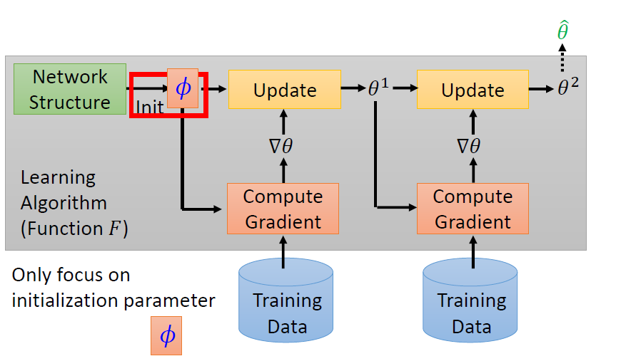

* In the past, parameters for a neural network is initialized according to some distribution
* MAML learn the "best" parameters for initialization which generalize across many tasks
* Define a network structure for solving different tasks
* Note that there are only one neural network for MAML

Black-box adaptation :
* Input: Initiazed parameters of F
* Output: Model parameters learned from task *n* , <code>θ^_n</code>

MAML :
* Initialize parameters for the network. These parameters are meta-parameters, 𝜙
* Task specific parameters, θ are obtained by performing gradient descent update on the meta-parameters using gradient for loss on support set of training task. This part is **optimization-based** adaptation of the **Optimization-based Meta Learning**
* Then, we compute loss on the query set of training task. The meta-parameters are updated using gradient of loss on query set
* Limitation of MAML is all tasks must use same model architecture

## Implementation of MAML

### Inner Update Rule
* Obtain task specific parameters, θ using the support set of training task
* Assuming one gradient update step

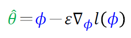

### Outer Update Rule
* Update the meta-parameters, 𝜙 using the test set or query set of training task
* Loss formula :

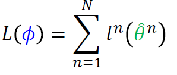
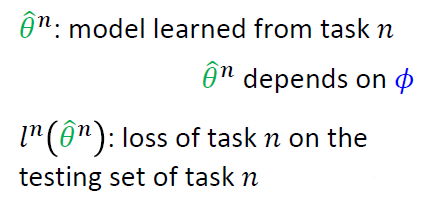

* Outer update rule :

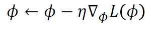

### MAML Algorithm

* Assuming one step gradient update 
1. Initialize the model parameters, 𝜙
2. Sample one training task (or a batch)
3. Sample support set and query set for sampled training task
4. Obtain task specific parameter <code>θ^_n</code> by applying the inner update rule using the support set (Fine tune 𝜙 for training task)
5. Compute loss on query set using <code>θ^_n</code>
6. Update 𝜙 using gradient of query set's loss by applying the outer update rule
7. Reiterate 2-7

Visualization of Training :

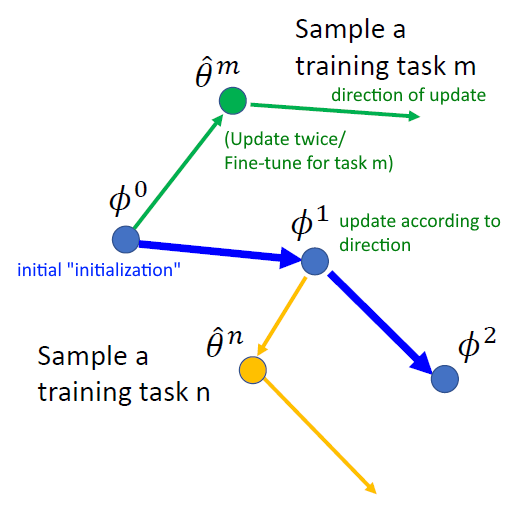

**Model Pre-training :**

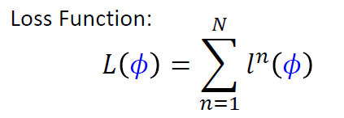

* Widely used in transfer learning
* In this case, 𝜙 is the parameters of the pre-trained model

### Comparison of MAML and Model Pre-training

**MAML**

* Doesn't care about performance of ϕ (initialized parameters) on the training tasks
* Cares about performance of task specific parameters <code>θ^_n</code> that would be obtained after training by using ϕ as initialized parameters

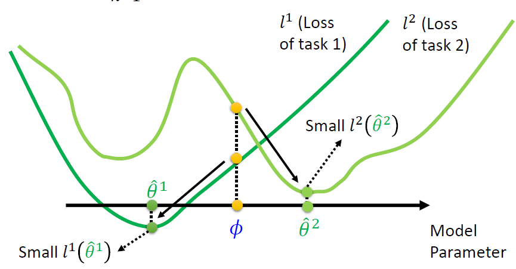

* Visualization of the loss curve for each task
* There are two tasks: task 1 and task 2
* The loss curve shows the loss for different choices of model parameters
* The yellow dot shows the loss for ϕ on each task, they are not at the local minima 
* Good ϕ can lead to the local minima easily 

Summary: Finds 𝜙 which achieves good performance after training (Focus on the potential of 𝜙)

**Model Pre-training**

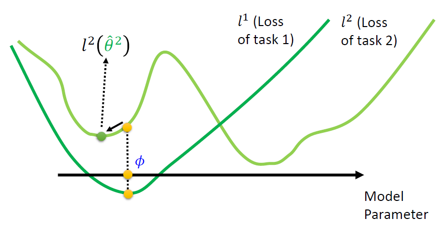

* Aims to find the "best" model parameters 𝜙 for every tasks
* Doesn't care so much about the result of using 𝜙 as initialization 
* Using  𝜙 as initialization may noy lead to good θ after training
* Using 𝜙 might get lower loss for each task when compared to MAML
* However, maybe stuck at the local minima, unable to improve over further training
Summary: Finds 𝜙 which achieves good performance (Focus on current performance of 𝜙)

## Reptile

### Reptile Implementation

Algorithm :

1. Initialize Φ, the initial parameter vector
2. * for iteration 1,2,3,… do
        * Randomly sample a task T
        * Perform k>1 steps of SGD on task T, starting with parameters Φ, resulting in parameters W
        * Update: Φ ← Φ + ϵ(W−Φ)
    * end for
3. Return Φ

Visualization :

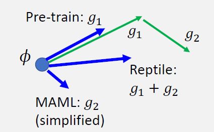

Implementation :
* Initialize Φ
* Clone the model. Initially the cloned model's parameters is Φ
    * Perform k > 1 steps of SGD on task T
        * The parameters of the cloned model are updated during each step
    * We denote the parameters of the cloned model after final step of SGD as W
    * Replace the gradient of the original model with **Reptile gradient**
        * Reptile gradient = W - Φ where Φ : parameters of the original model
    * Update Φ with Reptile gradient

[Result](https://openai.com/blog/reptile/)

* Reptile performs much better when compared to model pre-training

## Additional Material 
### [Toy Example for MAML](https://towardsdatascience.com/paper-repro-deep-metalearning-using-maml-and-reptile-fd1df1cc81b0)

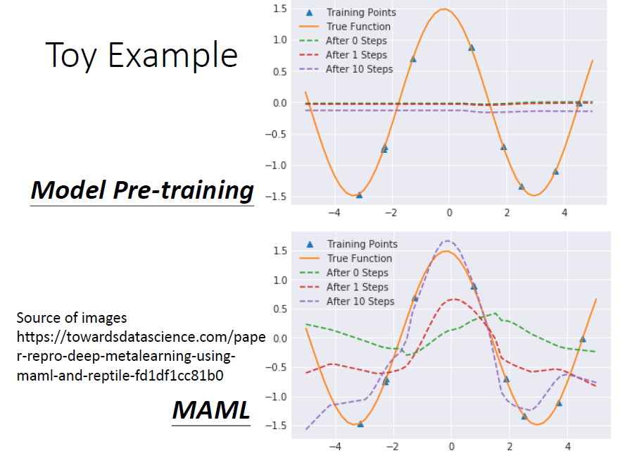