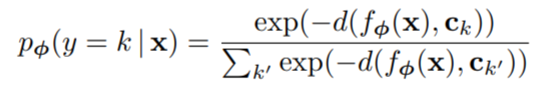
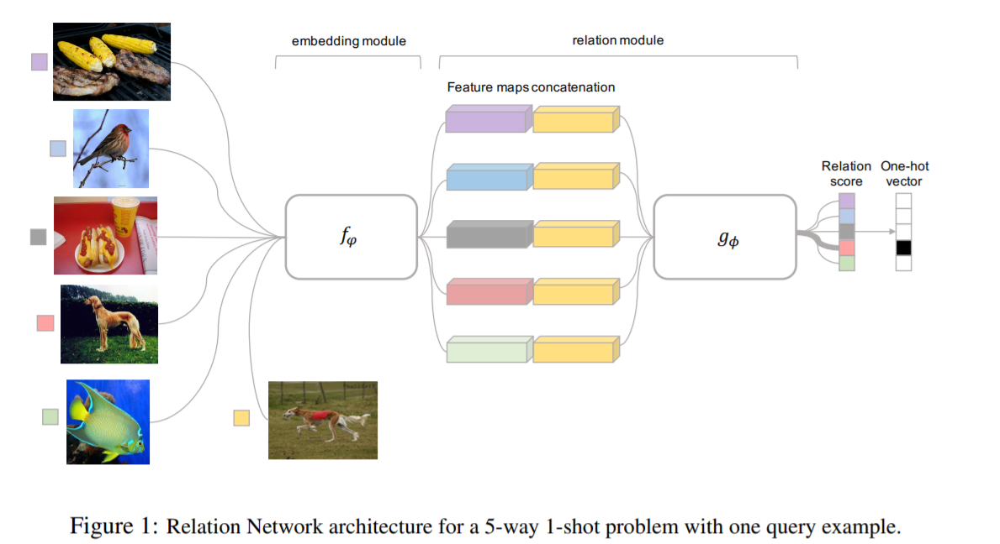

# Metric-based Meta Learning

## Introduction

* We want to learn a model which learns on training examples and can do prediction on testing data
* Input : Training data and labels, testing data
* Output : Predicted label of testing data

## Siamese Network

* Compare two face images belong to the same person or not
* Don't compare the face images pixel by pixel
* The idea is to extract important features which are representative of the face images and compare them instead
* The image are encoded into embedding vector using convolutional layers
* Both network share parameters 
* After the embedding vectors are obtained, a similarity metric such as Euclidean distance or Cosine similarity is used to measure similarity between two embedding vectors
* High score means yes, they belong to the same person
* Low score means no, they belong to different person

### Intuition of Siamese Network

* A binary classification problem of "Are them the same person"
* If they are same, the label is 1
* If they are different, the label is 0
* Just train it like a binary classification 

* Convolutional layers learn embedding for faces
* Can think of the embedding vector as representing the face image at a lower dimensional space
* Train it such that the face images of same person have their embeddings closer to each other
* Different person has embeddings which are far away from each other

### Other types of distance

* SphereFace : Deep Hypersphere Embedding for Face Recognition
* Additive Margin Softmax for Face Verification
* ArcFace : Additive Angular Margin Loss for Deep Face Recognition
* Triplet Loss :
    * Deep Metric Learning using Triplet Network
    * FaceNet : A Unified Embedding for Face Recognition and Clustering

## Prototypical Network

* Paper link : https://arxiv.org/abs/1703.05175
* Network structure :

* What if we have more than 2 person we want to compare ?
* N-way few-shot/one-shot learning problem
    * N classes, one or few examples per class
* Prototypical network uses an embedding function *f* to encode each face image into lower dimensional embedding vector

* Calculate an average embedding vector for each class, the mean vectors are called prototypes, denoted by *c*

* Prototypical Networks produce a distribution
over classes for a query point x based on a **softmax** over distances to the prototypes in the embedding space

where *d* is a differentiable distance function to measure similarity between embedding vector
* Loss function :

## Matching Network

* Paper link : https://arxiv.org/abs/1606.04080
* Network structure :

* Similar to Prototype Networks
* For Prototype Networks, there's no connection between different training examples 
* Replace CNN with Bidirectional LSTM
* Considering the relationship among the training examples

## Relation Network

* Paper link : https://arxiv.org/abs/1711.06025
* Network structure :

* Similar to Siamese Network, but doesn't use any distance function to measure similarity
* Function *f* encodes images into embedding vectors
* Concatenate each of the embedding vectors of training images with the embedding vector of test image
* Relation module consists of a CNN classifier *g* which predicts relation score for each pair
* The loss function uses MSE instead of cross entropy because predicting relation score is a regression task
* Loss function :

